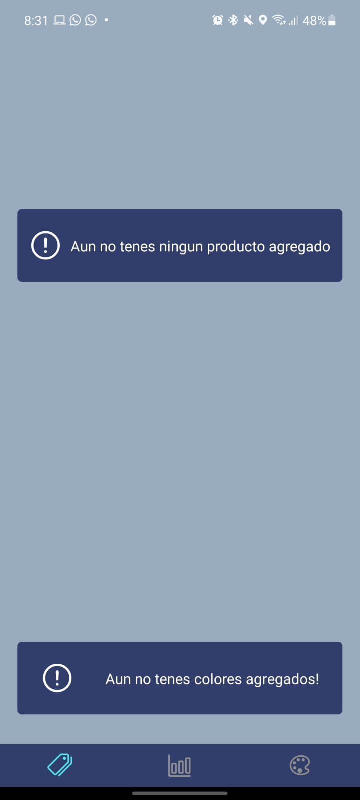
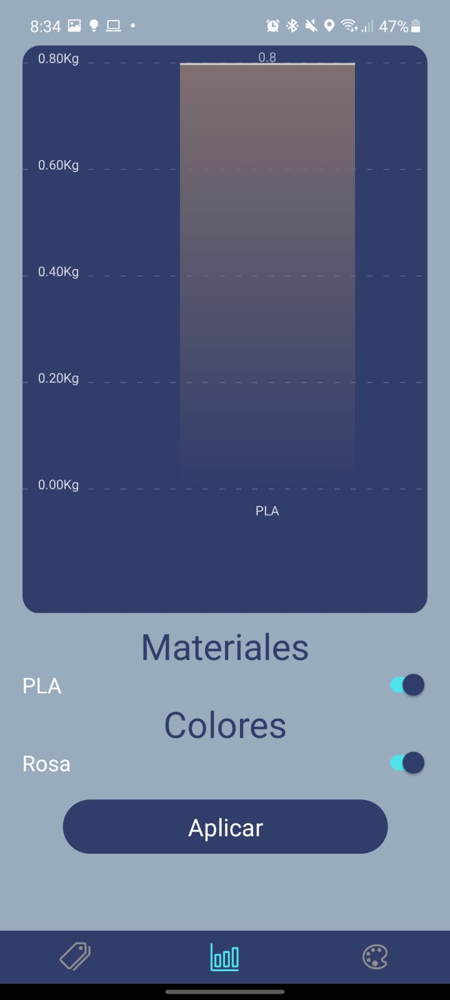
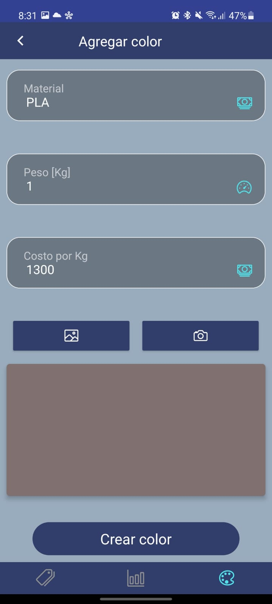
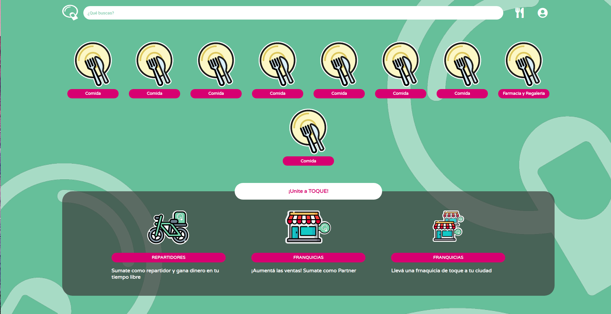

# Bienvenido a mi pagina de GITHUB :smile:

 

## Soy un ingeniero Full-Stack e Ingeniero Electronico :smiley_cat:

 

 

## Sobre Mi

### Quién soy?

Soy un estudiante avanzado de ingenieria electrónica, vivo en Cipolletti, Rio Negro, Argentina. Siempre fui un estusiasta de la tecnología y del mundo WEB, en 2019 comence a aprender Javascript en UDEMY. Este amor por el mundo WEB comenzo a crecer y paso a ser un hobbie estar leyendo sobre las tecnologías que lo rodeaban.

### Qué me interesa?

Desde muy chico me encanta el gaming, y es uno de mis grandes hobbies. En la pandemia comence a entrenar y descrubri una nueva forma de limpiar mi cabeza de mis tareas. Durante todo el día me suele acompañar la música, la cual voy variando depende de la tarea que me encuentre realizando.

 
 

# Mi Stack

### Lenguajes de programación

<ul>
    <li>
        Javascript/Typescript
    </li>
    <li>
        Dart
    </li>
    <li>
        Python
    </li>
    <li>
        C
    </li>
</ul>

### Herramientas

<ul>
    <li>
        ReactJS, Redux, Redux-saga, Redux-thunk, React Native
    </li>
    <li>
        NodeJs, Express, Sequelize, Mongoose
    </li>
    <li>
        MySQL, MariaDB, MongoDB
    </li>
    <li>
        Git, Docker, Docker-Compose
    </li>
    <li>
        Flutter
    </li>
    <li>
        Tensorflow, pytorch, numpy, matplotlib
    </li>
</ul>

# Proyectos
- ## Stock Filament 3D Printer

 

- ## Toque Clon (En proceso)

